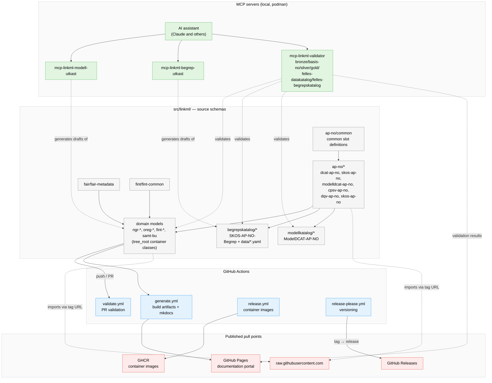
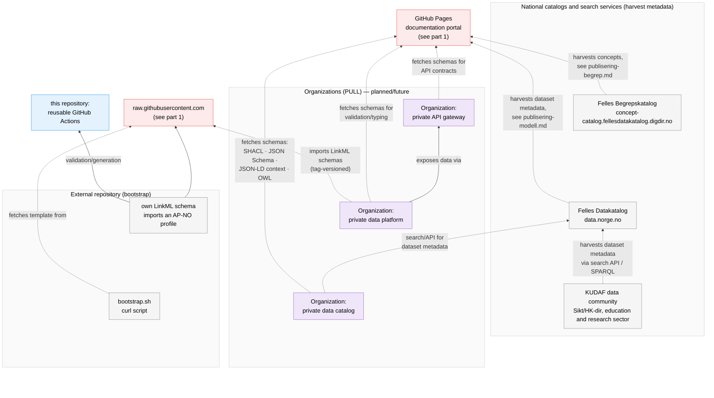

---
i18n:
  source: arkitektur-oversikt.md
  source_hash: sha256:db5e3a48c80ae64e1784d294ea414cbb83d2af1fe95645c32daf60722f520796
---
# Architecture overview {#arkitekturoversikt}

!!! note "Description"

    This page shows the essential parts of the repository and how they interact with external public services — from source schemas, via MCP servers and CI, to published artifacts and the national catalogs/organizations that harvest from them.

---

The sketch is split into two diagrams (instead of one wide one) to keep the text boxes
large and readable: part 1 covers the internal flow from source schemas to
published artifacts, part 2 covers how national catalogs, KUDAF and
organizations harvest from the published points. Invisible links (`~~~`) are only used
to force nodes without a real relationship to stack vertically instead of
spreading out horizontally — they do not represent a dependency.

## Part 1 — From source schemas to published artifacts {#del-1-fra-kildeskjema-til-publiserte-artefakter}

## Part 2 — How national catalogs, KUDAF and organizations harvest from this repository {#del-2-korleis-nasjonale-katalogar-kudaf-og-verksemder-hentar-fra-dette-repoet}

## Explanation of the essential parts {#forklaring-av-dei-vesentlege-delane}

- **Source schemas** (`src/linkml/`) — LinkML schemas organized in an
  import hierarchy (see `CLAUDE.md` § "LinkML Importhierarki"): the AP-NO profiles
  and FAIR metadata are non-standalone building blocks that the domain models
  import. `begrepskatalog/` and `modellkatalog/` are special cases that
  import AP-NO profiles in order to publish to external catalogs.
- **MCP servers** — three local container-based MCP servers let AI assistants
  generate schema drafts from JSON Schema, generate SKOS concept drafts, and
  validate schemas/instances against policy levels, without leaving the local environment.
- **GitHub Actions** — validates PRs, builds artifacts + the portal on push to
  `main`, builds/pushes container images on release tags, and captures
  validation history on release-please versioning. See
  [Artifact generation — sources and pipeline](../automasjon/artefakt-generering.md) § 5 for
  the detailed CI order, and [Monitoring the automation](../automasjon/monitorering.md)
  for how to read the logs from these workflows.
- **Published pull points** — the repository **is never pulled into, only from**: GitHub
  Pages is the published portal; GitHub Releases and
  `raw.githubusercontent.com` are stable fetch points for importing schemas from
  other repositories; GHCR distributes container images. See
  the [Publishing overview](../publisering/publisering-oversikt.md) section "Where
  generated files end up" for a full overview of what is located where.
- **National catalogs** — publishing to Felles Begrepskatalog and Felles
  Datakatalog are **manual** steps performed by a person following
  the guides in the portal — the repository does not push directly to these catalogs
  (cf. the "Pull, not push" principle in `CLAUDE.md`, fully explained with
  diagrams and examples in the [Publishing overview](../publisering/publisering-oversikt.md)).
- **External repository** — other repositories can bootstrap themselves with
  `bootstrap.sh` and import AP-NO profiles directly via tag-based
  `raw.githubusercontent.com` URLs, and validate/generate via the same
  reusable GitHub Actions workflows that this repository exposes.
- **Consumers of Felles Datakatalog and the published schemas** — these are
  future/planned integrations (see
  `specs/backlog/nasjonal-datamesh-arkitektur.md` for the full assessment), not
  something implemented in this repository today:
  - **KUDAF** (the data community of Sikt/HK-dir for the education and research sector) harvests
    dataset metadata from the search API/SPARQL endpoint of Felles Datakatalog —
    the same pattern data.norge.no itself uses to harvest
    DCAT-AP-NO metadata from GitHub Pages. The repository thus delivers data to KUDAF
    *indirectly*, via Felles Datakatalog as an intermediate store/hub.
  - **Private data catalogs, data platforms and API gateways** in organizations
    can fetch schema artifacts (SHACL, JSON Schema, JSON-LD context, OWL)
    directly from GitHub Pages, or import LinkML schemas tag-versioned
    via `raw.githubusercontent.com` — see the Publishing overview section
    "Private systems that can harvest" for format and usage details per
    consumer type.
  - All these connections are **pull**: none of the consumers receive pushes from
    this repository, in line with the "Pull, not push" principle.

## Related documentation {#relatert-dokumentasjon}

- [Artifact generation — sources and pipeline](../automasjon/artefakt-generering.md) — detailed source tracing for each automatically generated artifact
- [Publishing overview](../publisering/publisering-oversikt.md) — the "Pull, not push" principle, where generated files end up, and the step-by-step flow to data.norge.no
- [Monitoring the automation](../automasjon/monitorering.md) — how to monitor that the CI workflows actually work
