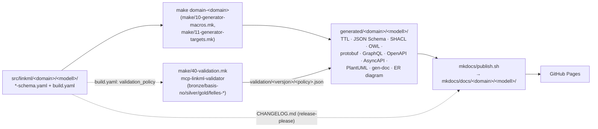

---
i18n:
  source: artefakt-generering.md
  source_hash: sha256:15a375af1e81e5c02b85eceb0df7f5bc74f1b4476b821bc64f156f43228ec314
---
# Artifact generation — sources and pipeline {#artefaktgenerering-kjelder-og-pipeline}

!!! note "Description"

    This page gives a precise answer to two questions for every automatically generated artifact in the repository: **how is it generated** (which `make` target, which command, which container), and **what is the source of its content** (which schema field, `build.yaml` key or other file controls what the artifact contains).

---

For the command reference (how to *run* the targets) — see
[`COMMANDS.md`](https://github.com/AudunAutomat/linkml-datamodellering-no/blob/main/COMMANDS.md).
For the principles behind the import hierarchy that the schemas themselves follow — see
[`PRINCIPLES.md`](https://github.com/AudunAutomat/linkml-datamodellering-no/blob/main/PRINCIPLES.md)
§ 3 and [Import hierarchy](../arkitektur/importhierarki.md). This page covers the layer *between*
the source schema and the published portal: what happens in `make/*.mk`, which scripts
run inside each container, and where each field in the end result
comes from.

## 1. Overall flow {#1-overordna-flyt}

All generation work goes through containers (podman) — see `make/01-containers.mk`
for the fixed runners (`LINKML_RUN`, `AVROTIZE_RUN`, `ASYNCAPI_RUN`,
`PYTHON_RUN`, `DOCS_RUN`). `generated/` is always build output, never source code
— whatever is there can be deleted and regenerated from `src/linkml/` at any time.

Each generator is gated by one key under `generators:` in the schema's
`build.yaml` (e.g. `shacl: true`). The filter is enforced by the shared
script `src/assets/scripts/makefile/run-parallel-gen.sh`, which greps
`build.yaml` for the key and runs the actual command only for
schemas where the flag is `true`. The same script also picks up any per-schema
CLI flag overrides (`shacl_flags`, `owl_flags`) via `--extra-flags-field`.

## 2. Per-artifact table {#2-per-artefakt-tabell}

All paths are relative to `generated/<domain>/<modell>/` unless otherwise
stated. `<n>` = schema name (file name without `-schema.yaml`).

| Artifact | `build.yaml` flag | Make target | Command (in container) | Output |
|---|---|---|---|---|
| JSON-LD context | `jsonld_context` | `gen-jsonld-context` | `gen-jsonld-context <schema>` | `<n>-context.jsonld` |
| SHACL shapes | `shacl` (+ optional `shacl_flags`) | `gen-shacl` | `gen-shacl ${shacl_flags} <schema>` | `<n>-shapes.ttl` |
| Python data model | `python` | `gen-python` | `gen-python <schema>` | `<n>-model.py` |
| JSON Schema | `json_schema` | `gen-jsonschema` | `gen-json-schema <schema>` | `<n>-schema.json` |
| OWL ontology | `owl` (+ optional `owl_flags`) | `gen-owl` | `gen-owl ${owl_flags:-$OWL_DEFAULT_FLAGS} <schema>` (default: `--skip-vacuous-local-range-axioms --skip-vacuous-min-zero-cardinality-axioms --consolidate-cardinality-axioms`) | `<n>-ontology.ttl` |
| RDF/OWL schema | `rdf` | `gen-rdf` | `gen-rdf <schema>` | `<n>-schema.ttl` |
| XSD | `xsd` (requires `json_schema` output) | `gen-xsd` | 3 steps: avrotize `j2a` (JSON Schema → Avro), avrotize `a2x` (Avro → XSD, namespace from `id:`), then `fix-xsd-dates.py` (fixes `date`/`date-time` fields that avrotize would otherwise turn into `xs:integer`/`xs:long`) | `<n>-schema.xsd` |
| Protobuf | `protobuf` | `gen-proto` | `gen-proto <schema>` | `<n>-schema.proto` |
| GraphQL | `graphql` | `gen-graphql` | `gen-graphql <schema>` | `<n>-schema.graphql` |
| Java classes | `java` | `gen-java` | `gen-java --output-directory java --package <pakke> <schema>` (package derived from the schema's `id:` URI, reversed domain notation) | `java/<Klassenamn>.java` (one file per class/enum) |
| OpenAPI | `openapi` (requires `json_schema`) | `gen-openapi` | own `gen-openapi.py` (not a linkml command — wraps JSON Schema `$defs` into `components/schemas`, takes `info.title/version/description` from the schema), validated with `openapi-spec-validator` | `<n>-openapi.yaml` |
| AsyncAPI | `asyncapi` (requires `json_schema`) | `gen-asyncapi` | own `gen-asyncapi.py` (same pattern as openapi), validated with `asyncapi validate` | `<n>-asyncapi.yaml` |
| ER diagram (Markdown) | `erdiagram` | `gen-erdiagram-mermaid` | `gen-erdiagram --no-mergeimports <schema>` → `filter_container.awk` (removes the container class) → `filter_erdiagram.py` (removes imported classes) | `<n>-erdiagram-unfiltered.md`, `<n>-erdiagram.md` |
| PlantUML diagram | `plantuml` | `gen-plantuml` | `gen-plantuml <schema>` → `filter_plantuml.py` in two modes (`filtered` = local classes only, `full` = all except the container class) → the PlantUML container renders SVG | `diagrams/<n>-raw.puml`, `diagrams/<n>-filtered.puml(+.svg)`, `diagrams/<n>.puml(+.svg)` |
| gen-doc (class documentation) | `docs` | part of `gen-schema-docs` | `gen-docgen-examples.py` (splits the example file per class instance) → `gen-doc --template-directory src/assets/templates/docgen --no-mergeimports --no-render-imports --no-hierarchical-class-view --diagram-type mermaid_class_diagram --example-directory ... <schema>` → `sed -i "/Container/d" docs/index.md` | `docgen-examples/*.yaml`, `docs/*.md` (one per class/slot/enum/type/subset + `docs/index.md`) |
| RDF example data | `example_rdf` (default `true`) | built into `domain_target`, no separate gen target | `linkml-convert --schema <schema> --output-format ttl --no-validate --output ... <eksempelfil>` | `<n>-eksempel.ttl` |
| Information model instance | *(no `build.yaml` gate — always runs)* | `gen-informasjonsmodell-instance` | own `generate-informasjonsmodell.py <schema>` | `src/linkml/<domain>/<modell>/metadata/<modell>-manifest.yaml` |

`docgen_examples: false` (in `generators:`) is a separate opt-out for
example splitting in the gen-doc step, independent of the `docs` flag.

## 3. Source tracing per artifact type {#3-kjeldesporing-per-artefakttype}

### 3.1 The purely LinkML-generated artifacts (JSON-LD, SHACL, Python, JSON Schema, OWL, RDF, protobuf, GraphQL) {#31-dei-reine-linkml-genererte-artefakta-json-ld-shacl-python-json-schema-owl-rdf-protobuf-graphql}

These have one source: the `<modell>-schema.yaml` itself (including everything it
imports, since `linkml gen-*` resolves the import hierarchy). Field names,
`class_uri`/`slot_uri`, `required`, `range`, `multivalued` etc. map
directly to the corresponding concept in the target format. The container class
(`tree_root: true`) is always included in these artifacts — they do **not**
filter it out (unlike the ER diagram, PlantUML and gen-doc's
`docs/index.md`, which explicitly remove container references).

### 3.2 XSD, OpenAPI, AsyncAPI {#32-xsd-openapi-asyncapi}

These use **the JSON Schema artifact as an intermediate step**, not the schema
directly — they require `json_schema: true` to be set as well, and
`run-parallel-gen.sh` enforces this via `--check-suffix schema.json`
(fails early if the JSON Schema file is missing). In terms of content:

- **XSD**: the structure comes from the JSON Schema → Avro → XSD conversion
  (avrotize). `date`/`date-time` formats are explicitly fixed in a separate
  Python step (`fix-xsd-dates.py`) because avrotize does not handle JSON
  Schema's logical date types correctly — this is a known
  tool limitation, not a modeling choice.
- **OpenAPI/AsyncAPI**: the schema part itself (`components/schemas`) is a
  rewritten JSON Schema (`$defs` → `components/schemas`,
  references rewritten accordingly). `info.title`/`info.version`/
  `info.description` are taken from the schema's `title`/`version`/
  `description` fields. `paths: {}` is always empty — these artifacts
  describe **the data model**, not an actual API endpoint.

### 3.3 ER diagram and PlantUML {#33-er-diagram-og-plantuml}

Both run `linkml gen-erdiagram`/`gen-plantuml` first (raw output with
*all* classes, including imported ones and the container class), and then filter
in a separate Python/awk step:

- **Filtered version** (`*-filtered.md`/`*-filtered.puml`): only classes
  defined locally in the schema's `classes:` block. This is the version
  the portal shows by default.
- **Full version** (`*.puml`): all classes except the container class,
  including imported classes from e.g. `dcat-ap-no`. Linked as "(full)"
  from the portal.

The filtering logic thus reads **the schema's own `classes:` keys**
to decide what is "local" — not a hard-coded list.

### 3.4 gen-doc (`docs/*.md`, the "Modellmetadata" table) {#34-gen-doc-docsmd-modellmetadata-tabellen}

The template (`src/assets/templates/docgen/index.md.jinja2`) is a
customized LinkML docgen template, not the standard template. The metadata table at
the top of each schema's `docs/index.md` is taken directly from LinkML's
`schema` object: `name`, `title`, `description`, `id`, `version`,
`license`, `imports`, as well as `annotations.utgiver`, `annotations.status`,
`annotations.endringsdato`, `annotations.utgivelsesdato` (the silver
annotations — see CLAUDE.md § "Silver-annotasjonar"). Class/slot/
enum/type lists are generated by traversing `schemaview.all_classes()`
etc., with usage marks ("✅ Brukt lokalt" / "⚠️ Definert lokalt") computed
from what is actually referenced in the model. Example content in the
class pages comes from `docgen-examples/*.yaml`, which is the
example instance file (`examples/<modell>-eksempel.yaml`) split into one file
per top-level instance.

### 3.5 Validation (`validation/<versjon>/<policy>.json`) {#35-validering-validationjson}

The policy is **detected** from the `build.yaml` field `validation_policy`
(default `bronze` if the field is missing) — see `detect-validation-policy.py`.
The validation itself runs in the `mcp-linkml-validator` container, which receives
a *flattened* schema (`gen-linkml --mergeimports`) plus an example file
if the model has `tree_root`. The policy rules (`src/mcp-linkml-validator/policies/*.yaml`)
are mounted read-only, not built into the image, so policy changes do
not require a new image build.

All three write paths to `validation/<versjon>/<policy>.json`
(`run-validation.sh`, `save-validation-log.py`, and
`src/mcp-linkml-validator/validate-and-log.py`) now go through the shared
module `src/assets/scripts/utils/validation_log.py`, which guarantees the same
set of fields in all cases: `{schema, domain, version, validation_policy,
validated_at, result}`. Until this was fixed, the three paths wrote
different field names (`validation_policy` vs `validation_type`, with/without
`validated_at`) — see
[bugs/valideringslogg-json-inkonsistent-skjema.md](https://github.com/AudunAutomat/linkml-datamodellering-no/blob/main/bugs/valideringslogg-json-inkonsistent-skjema.md)
(BUG-12, `løyst`) for history. Existing, already committed
`validation/**/*.json` files from before the fix may still have the old
field name — `mkdocs/lib/scripts/generate-validation-md.py` is independent of
this (reads `validated_at` with a fallback, and derives the policy from `build.yaml`,
never from the JSON field).

### 3.6 Information model instance and model catalog {#36-informasjonsmodell-instans-og-modellkatalog}

`generate-informasjonsmodell.py` builds one `Informasjonsmodell` instance
per schema (written to `src/linkml/<domain>/<modell>/metadata/<modell>-manifest.yaml`).
The sources for each field (`schema.yaml`, `build.yaml`, `CODEOWNERS.md`,
local classes, generated artifacts) are documented in full detail in
[Model manifest generation](modellmanifest-generering.md) — not
repeated here.

`make gen-modellkatalog-instance` then collects all `**/metadata/*-manifest.yaml`
across the repository, groups them by publisher (matched against
`CODEOWNERS.md`'s `org_uri`), and writes one data file per organization under
`src/linkml/modellkatalog/<catalog>/data/<catalog>/<catalog>.yaml` — this
is the data file that is eventually published to Felles Datakatalog via
ModelDCAT-AP-NO. The same pattern applies to `gen-begrepskatalog-instance`
(`collect-concepts.py`) for the concept catalog, which collects `begrep/*.yaml`
from all `begrepssamling-*` directories.

The `30-instances.mk` target `validate-informasjonsmodell-instance` derives
the `<modell>-manifest.yaml` path directly from `SCHEMA` (the same pattern that
`generate-informasjonsmodell.py` itself uses for the file name). It previously
referred to the old, shared path `metadata/modelldcat.yaml` — see
[bugs/informasjonsmodell-instance-stale-metadata-sti.md](https://github.com/AudunAutomat/linkml-datamodellering-no/blob/main/bugs/informasjonsmodell-instance-stale-metadata-sti.md)
(BUG-11, `løyst`) for history.

### 3.7 CHANGELOG.md — NOT generated by the make pipeline {#37-changelogmd-genereres-ikkje-av-make-pipelinen}

`CHANGELOG.md` per schema is **never** written by anything in `make/` or
`src/assets/scripts/`. It is produced by `googleapis/release-please-action`
(`.github/workflows/release-please.yml`), configured with one
release-please "package" per model directory in `.github/release-please-config.json`.
Release-please reads the conventional commit history scoped to each
package path and writes/updates `CHANGELOG.md` directly in the release PR.
The same step (`release-please.yml`) also synchronizes the schema's
`version:` and `annotations.endringsdato`/`annotations.utgivelsesdato`
to the new version (via `yq`). The portal (`mkdocs/lib/sections/versjonslog.sh`)
then copies this file raw into each schema's published `index.md`
(strips the H1, demotes `##`→`###`) — see § 4.

### 3.8 published-uris.lock — manually maintained ledger {#38-published-urislock-manuelt-vedlikehalden-ledger}

`published-uris.lock` is **not generated** by any script. It is a
manually maintained, append-only list of URIs that have already been
published externally (Felles Begrepskatalog/data.norge.no), used as a
guard mechanism (`make check-published-uris`, run in `validate.yml`) to
prevent published URIs from being removed or changed afterwards.
`mkdocs/publish.sh` **reads** the file (existence check) to show a
"Publisert til" ("Published to") column in the portal, but never writes to it.

## 4. From `generated/` to the published portal (`mkdocs/publish.sh`) {#4-fra-generated-til-publisert-portal-mkdocspublishsh}

See CLAUDE.md § "Korleis `publish.sh` fungerer" for the four-step overview.
Clarifications from reading the source that are not stated there:

- **Step 1** also cleans up *entire* `mkdocs/docs/<domain>/` directories
  for domains that no longer exist in `generated/` (not just emptying
  existing domains).
- Between step 1 and step 2 there is an unspoken "step 1.5": a scan of all
  `build.yaml` files for `submodels:`, which builds a parent/submodel map
  used both in the nav menu (step 4) and in each schema's `index.md`
  (submodel box / submodel section).
- **The metadata table** in the published `index.md` is **not** regenerated
  by `publish.sh` — it extracts the Modellmetadata section
  verbatim from gen-doc's own `docs/index.md` (awk between
  the `## @@i18n:docgen.modellmetadata@@` marker and the next heading; the marker
  is replaced with the text for each language at the end, see
  [Multilingual portal](fleirsprak.md)). The source of the table is therefore gen-doc/LinkML itself
  (§ 3.4), not `publish.sh`.
- **The artifact table** in the domain `index.md` (`shapes.ttl`, `context.jsonld`,
  `schema.json`, `schema.xsd`, `openapi.yaml`, `asyncapi.yaml`,
  `ontology.ttl`, `schema.ttl`, `model.py`, `schema.proto`, `schema.graphql`,
  `erdiagram.md`, `eksempel.ttl`) is built by actually checking which files exist on disk
  per schema — not from the `build.yaml` flags directly. A generator that
  is switched off in `build.yaml` will therefore simply not have a file to
  list, rather than being shown as "unavailable".
- **The Valideringsresultat section** re-derives the policy from `build.yaml`'s
  `validation_policy` (authoritative), not from the field in the JSON file — see § 3.5.

## 5. CI orchestration (`.github/workflows/generate.yml`) {#5-ci-orkestrering-githubworkflowsgenerateyml}

Order: `checkout-source` → `ensure-images` (builds/pulls only
the container images each domain actually needs, derived from
`src/assets/containers/images.json`'s `required_if_generator_flag`
matched against `build.yaml`) → `generate` (matrix per domain: validates all
schemas in the domain via `run-validation.sh --manifest`, copies existing
`src/linkml/**/validation/<versjon>/` into `generated/`, then runs
`make domain-<domain>`, which generates all the artifacts from § 2) → `publish`
(merges all `generated-<domain>` artifact uploads, runs
`make docs-publish && make docs-build`, deploys to GitHub Pages).

For what `validate.yml` does (nightly cron + PR + manual validation,
log storage, PR creation for updated validation logs) and how you
interpret the logs from both workflows — see
[Monitoring of automation](monitorering.md), which covers this in detail.

## 6. Quick lookup table: "where does X come from?" {#6-kjapp-oppslagstabell-kvar-kjem-x-fra}

| You are wondering about... | The source is... |
|---|---|
| Class names, slot names, `range`, `required` in a generated format | The `classes:`/`slots:` of `<modell>-schema.yaml` (§ 3.1) |
| The "Modellmetadata" table in the portal | `schema` metadata + silver annotations, via gen-doc (§ 3.4, § 4) |
| Which classes are shown in the ER diagram/PlantUML | The schema's own `classes:` block, filtered by `filter_erdiagram.py`/`filter_plantuml.py` (§ 3.3) |
| The "Valideringsresultat" section | `validation/<versjon>/<policy>.json`, policy from `build.yaml.validation_policy` (§ 3.5) |
| The "Versjonslog" section | `CHANGELOG.md`, written by release-please, not by the make pipeline (§ 3.7) |
| The "Publisert til" column | Existence of `published-uris.lock`, manually maintained (§ 3.8) |
| `Informasjonsmodell`/model catalog entries | `generate-informasjonsmodell.py` — see [Model manifest generation](modellmanifest-generering.md) (§ 3.6) |
| Which artifact files are linked in the portal | Actual files on disk in `generated/<domain>/<modell>/`, not the `build.yaml` flags directly (§ 4) |

## Related documentation {#relatert-dokumentasjon}

- [Architecture overview](../arkitektur/arkitektur-oversikt.md) — the big picture: how this pipeline fits together with MCP servers, CI and external consumers
- [Structure of index.md](index-md-struktur.md) — deep dive into the sections of each schema's published page
- [Model manifest generation](modellmanifest-generering.md) — complete source table for the Informasjonsmodell instance (§ 3.6)
- [Monitoring of automation](monitorering.md) — how the CI workflows actually run and how you interpret the logs (§ 5)
