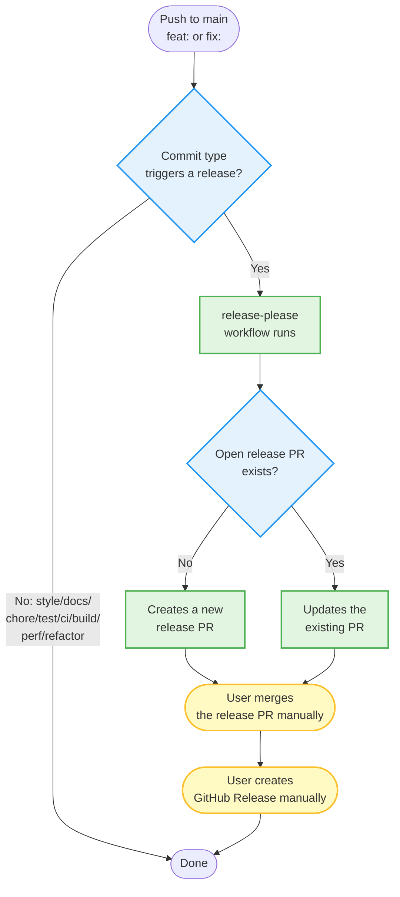

---
i18n:
  source: monitorering.md
  source_hash: sha256:d244c6578cd8226b573a4f719484eeca40c724a53061b306636e497876fc9c9d
---
# Monitoring of automation {#monitorering-av-automasjon}

!!! note "Description"

    This page explains how you can monitor that the generation and publishing of artifacts work as expected.

---

## GitHub Actions logs (primary monitoring) {#github-actions-loggar-primr-monitorering}

In the PoC phase, **GitHub Actions logs** are the primary monitoring mechanism.

### Where do I find the logs? {#kvar-finn-eg-loggane}

**Main overview of all workflows:**
```
https://github.com/AudunAutomat/linkml-datamodellering-no/actions
```

**Specific workflows:**

| Workflow | URL | What it does |
|---|---|---|
| `generate.yml` | [actions/workflows/generate.yml](https://github.com/AudunAutomat/linkml-datamodellering-no/actions/workflows/generate.yml) | Validates, generates artifacts and publishes to GitHub Pages |
| `validate.yml` | [actions/workflows/validate.yml](https://github.com/AudunAutomat/linkml-datamodellering-no/actions/workflows/validate.yml) | Nightly validation (02:00 UTC) that stores logs in `src/linkml/*/validation/` and creates a PR on changes |
| `release-please.yml` | [actions/workflows/release-please.yml](https://github.com/AudunAutomat/linkml-datamodellering-no/actions/workflows/release-please.yml) | Creates release PRs automatically |
| `release.yml` | [actions/workflows/release.yml](https://github.com/AudunAutomat/linkml-datamodellering-no/actions/workflows/release.yml) | Builds and pushes container images on release |

---

## Release workflow {#release-arbeidsflyt}

The repository uses [release-please](https://github.com/googleapis/release-please) to automate release PR creation based on [Conventional Commits](https://www.conventionalcommits.org/). The workflow has two parts: automatic PR creation and manual release publishing.

### Flow diagram {#flytdiagram}



**Color codes:**

- 🟢 **Green** — automatic process (runs without user intervention)
- 🟡 **Yellow** — manual process (requires user action)
- 🔵 **Blue** — decision point (logic in the workflow)

### Manual release publishing {#manuell-release-publisering}

After the release PR has been merged, the user must create the GitHub Release manually. This is necessary because `GITHUB_TOKEN` in GitHub Actions lacks permission to create releases in this repository.

**Option 1: Via the GitHub UI**

1. Go to [Releases](https://github.com/AudunAutomat/linkml-datamodellering-no/releases)
2. Click **Draft a new release**
3. Click **Choose a tag** → enter the tag name (e.g. `samt-bu-v1.0.4`) → click **Create new tag: samt-bu-v1.0.4 on publish**
4. Fill in:
   - **Release title:** `samt-bu 1.0.4`
   - **Description:** Copy from `CHANGELOG.md` or write manually
5. Click **Publish release**

**Tip:** You find the tag name and version in the release PR (e.g. PR #25) or in `.github/release-please-manifest.json`.

**Option 2: Via the GitHub CLI**

```bash
# Get the version from the manifest
VERSION=$(jq -r '."src/linkml/<domain>/<modell>"' .github/release-please-manifest.json)
COMPONENT="<modell>"

# Create the release
gh release create "${COMPONENT}-v${VERSION}" \
  --title "${COMPONENT} ${VERSION}" \
  --notes "Release ${VERSION} for ${COMPONENT}"
```

**Example for samt-bu:**

```bash
VERSION=$(jq -r '."src/linkml/samt/samt-bu"' .github/release-please-manifest.json)
gh release create "samt-bu-v${VERSION}" \
  --title "samt-bu ${VERSION}" \
  --notes "Release ${VERSION} for samt-bu"
```

See [CONTRIBUTING.md](https://github.com/AudunAutomat/linkml-datamodellering-no/blob/main/CONTRIBUTING.md) for the complete procedure.

---

### What do the logs show? {#kva-viser-loggane}

**`generate.yml` (the most important workflow):**

1. **Validation:**
   - `make lint` — LinkML schema lint
   - `make mcp-linkml-valider-modell` — policy validation (bronze/silver/gold/felles-begrepskatalog/felles-datakatalog)
   - `make validate-instance` — instance validation of example files

2. **Generation:**
   - `make <domain>` — generates SHACL, JSON Schema, OWL, Python, Protobuf, documentation, diagrams
   - `make convert-data` — converts YAML to SKOS/Turtle and ModelDCAT-AP-NO

3. **Publishing:**
   - `make docs-publish` — regenerates the mkdocs portal
   - `actions/deploy-pages@v1` — publishes to GitHub Pages

**Example of a successful run:**
```
✓ lint (ngr-virksomhet)
✓ mcp-linkml-valider-modell POLICY=bronze
✓ generate ngr
✓ publish
✓ Deploy to GitHub Pages
```

**Example of a failed run:**
```
✗ mcp-linkml-valider-modell POLICY=felles-begrepskatalog
  Error: Missing required field: dct:publisher
```

---

**`validate.yml` (nightly validation and logging):**

1. **Validation per domain (in parallel):**
   - Validates schemas against the `validation_policy` from `build.yaml`
   - Validates example files against the schema
   - Validates data files against publishing policies
   - Checks that published URIs have not been removed

2. **Log storage:**
   - Stores JSON logs in `src/linkml/<domain>/<modell>/validation/<version>/<policy>.json`
   - Filters out unchanged logs (ignores the `validated_at` field)

3. **PR creation (only on changes):**
   - Creates a PR with the title: `chore(validation): oppdater valideringsloggar (N modellar)`
   - The PR only contains logs with actual changes (new violations or improvements)
   - Labels: `automated`, `validation`

**Example of a successful run:**
```
✓ validate / ap-no
✓ validate / ngr
✓ Filtrer ut uendra loggar
  - 12 identiske (fjerna)
  - 3 endra (behelde)
  - 1 nye (behelde)
✓ Lag PR med valideringsloggar (4 modellar)
```

**When does `validate.yml` run?**
- **Nightly:** at 02:00 UTC (writes logs + creates a PR)
- **Manually:** `workflow_dispatch` (writes logs + creates a PR)
- **PR validation:** on `pull_request` against schemas or validator code (validation only, no logging)

### How long are logs kept? {#kor-lenge-vert-loggar-lagra}

GitHub keeps workflow logs for **90 days**. After that they are deleted automatically.

### How to filter logs? {#korleis-filtere-loggar}

**Filter by branch:**
- Click the "Branch" dropdown and choose `main`, `feature/mi-branch`, etc.

**Filter by status:**
- "Success" (green): Everything went well
- "Failure" (red): Validation or generation failed
- "Cancelled" (gray): The run was cancelled manually

**Filter by date:**
- "Event" → "Push" / "Pull request" / "Schedule"

**Search by commit message:**
- Use the search field at the top: `feat(ngr-adresse): legg til postnummer`

### Example: Checking the latest publication {#eksempel-sjekke-siste-publisering}

1. Go to https://github.com/AudunAutomat/linkml-datamodellering-no/actions/workflows/generate.yml
2. Check that the top run is green (✓)
3. Click the run to see the detailed log
4. Check the "Deploy to GitHub Pages" step — successful if there is a green check mark

---

## Verifying publication to GitHub Pages {#verifisere-publisering-til-github-pages}

After `generate.yml` has run successfully, verify that the artifacts have actually been published to GitHub Pages.

### Main portal {#hovudportal}

**URL:** https://audunautomat.github.io/linkml-datamodellering-no/en/

**What should be there:**
- The MkDocs documentation portal
- A navigation menu with domains (AP-NO, NGR, FINT, etc.)
- Generated schema pages with documentation and diagrams

### Generated artifacts {#genererte-artefakter}

**Example — SHACL shapes for ngr-virksomhet:**
```
https://audunautomat.github.io/linkml-datamodellering-no/ngr/ngr-virksomhet/ngr-virksomhet-shapes.ttl
```

**Example — JSON Schema:**
```
https://audunautomat.github.io/linkml-datamodellering-no/ngr/ngr-virksomhet/ngr-virksomhet-schema.json
```

**Example — concept catalog (SKOS/Turtle):**
```
https://audunautomat.github.io/linkml-datamodellering-no/begrepskatalog/brreg-begrepskatalog/brreg-begrepskatalog.ttl
```

### Verifying that the file is updated {#verifisere-at-fila-er-oppdatert}

**Manual check:**

```bash
curl -I https://audunautomat.github.io/linkml-datamodellering-no/ngr/ngr-virksomhet/ngr-virksomhet-schema.json
```

Check the `Last-Modified` header:
```
Last-Modified: Sun, 29 Jun 2026 14:32:15 GMT
```

**Alternative — check in the browser:**
1. Open the URL in the browser
2. Right-click → "Inspect" → the "Network" tab
3. Refresh (F5)
4. Check the `Last-Modified` or `Date` header

### Verifying that harvesting endpoints are available externally {#verifisere-at-hstingsendepunkt-er-tilgjengelege-eksternt}

**Test that TTL files are available to Felles Begrepskatalog/Datakatalog:**

```bash
curl -H "Accept: text/turtle" https://audunautomat.github.io/linkml-datamodellering-no/begrepskatalog/brreg-begrepskatalog/brreg-begrepskatalog.ttl
```

If you get Turtle data back (starting with `@prefix`), the harvesting endpoint works.

---

## Future monitoring options {#framtidige-monitoreringsalternativ}

These options can be added as needed, but are **not necessary in the PoC phase**.

### 1. GoatCounter (visitor statistics) {#1-goatcounter-besksstatistikk}

**What:** Privacy-friendly, GDPR-compliant, open source web analytics  
**Cost:** Free for open source projects  
**Implementation:** ~30 minutes

**Advantages:**
- ✅ No cookies — no consent banner needed
- ✅ GDPR-compliant — perfect for the public sector
- ✅ Open source
- ✅ Shows: visits per page, referrers, country, browser

**How to implement:**

1. Register at https://www.goatcounter.com/
2. Create a "site" (e.g. `brreg-linkml`)
3. Add a script tag to MkDocs:

   **Create `mkdocs/lib/templates/main.html`:**
   ```html
   
   
   
     <script data-goatcounter="https://brreg-linkml.goatcounter.com/count"
             async src="//gc.zgo.at/count.js"></script>
   
   ```

   **Render the template per language:** `theme.custom_dir` is already set to
   `overrides-<lang>` in `mkdocs/build/mkdocs.<lang>.yml`. Add an
   `i18n_render` line for `main.html` in Steg 2c in `mkdocs/publish.sh`, the same
   pattern as for `404.html` (see [Multilingual portal](fleirsprak.md)).

4. Push to `main` and wait for GitHub Pages to update

**Dashboard:** https://brreg-linkml.goatcounter.com/

### 2. UptimeRobot (uptime monitoring) {#2-uptimerobot-uptime-monitorering}

**What:** Monitors that GitHub Pages is up and available  
**Cost:** Free tier (50 monitors, 5-minute interval)

**Advantages:**
- ✅ Email notification if the site goes down
- ✅ Uptime history (99.9%, etc.)
- ✅ Free for basic needs

**How to implement:**

1. Register at https://uptimerobot.com/
2. Add a new monitor:
   - **Monitor Type:** HTTP(s)
   - **Friendly Name:** LinkML Datamodellering Portal
   - **URL:** `https://audunautomat.github.io/linkml-datamodellering-no/`
   - **Monitoring Interval:** 5 minutes
3. Add an email address for notifications

**Use:** Automatic notification if GitHub Pages is down

### 3. RSS feed for releases {#3-rss-feed-for-releases}

**What:** GitHub automatically generates an RSS feed for releases

**URL:**
```
https://github.com/AudunAutomat/linkml-datamodellering-no/releases.atom
```

**Use:**
- Subscribe in an RSS reader (Feedly, Inoreader, etc.)
- Get notified when a new version is published

---

## Limitations {#avgrensingar}

The limitations below are a direct consequence of the repository practicing
"Pull, not push" (see [Publishing overview](../publisering/publisering-oversikt.md)
for a full explanation of the principle): the repository has no API access or
credentials for external catalogs, and therefore cannot monitor what
happens *after* artifacts have been published to GitHub Pages.

### What the repository CANNOT monitor {#kva-repoet-ikkje-kan-monitorere}

1. **Whether Felles Begrepskatalog/Datakatalog actually harvest data**
   - Harvesting happens externally (the responsibility of the Norwegian Digitalisation Agency)
   - The repository has no API access to data.norge.no
   - Must be checked manually at https://data.norge.no/concepts or https://data.norge.no/models

2. **Visitor statistics on data.norge.no**
   - Statistics from data.norge.no are not available to us
   - Requires access to the Norwegian Digitalisation Agency's analytics tools

3. **Error logs from external systems**
   - If Felles Begrepskatalog fails during harvesting, we are not notified
   - Contact the Norwegian Digitalisation Agency if you suspect a problem

### What you must do manually {#kva-du-ma-gjere-manuelt}

**Verify that data is actually visible on data.norge.no:**

1. **Concept catalogs:**
   - Go to https://data.norge.no/concepts
   - Search for a concept from your catalog (e.g. "foretaksnavn")
   - Verify that it is shown with the correct publisher and definition

2. **Model catalogs:**
   - Go to https://data.norge.no/models
   - Search for your model (e.g. "Nasjonale grunndata - Virksomhet")
   - Verify that it is shown with the correct metadata

**Contact the Norwegian Digitalisation Agency if:**
- Data has been published to GitHub Pages (verified)
- But is not shown on data.norge.no after 24-48 hours
- Email: dataopen@digdir.no

---

## Related documentation {#relatert-dokumentasjon}

- [Publish to Felles Begrepskatalog](../publisering/publisering-begrep.md) — guide for concept catalogs
- [Publish to Felles Datakatalog](../publisering/publisering-modell.md) — guide for model catalogs
- [Publishing overview](../publisering/publisering-oversikt.md) — publishing flow from the repository to external catalogs
- [GOVERNANCE.md](https://github.com/AudunAutomat/linkml-datamodellering-no/blob/main/GOVERNANCE.md) — publishing policy
