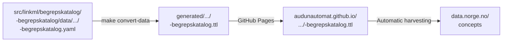

---
i18n:
  source: publisering-begrep.md
  source_hash: sha256:313acd4cb6e36ec9610b4100bbf987b877d136a305e41d7829da2e23df5df2d7
---
# Publish to Felles Begrepskatalog {#publiser-til-felles-begrepskatalog}

!!! note "Description"

    This guide shows how concept definitions in `src/linkml/begrepskatalog/<katalog>/data/` are converted to SKOS/Turtle and **prepared for automatic harvesting** by [Felles Begrepskatalog](https://data.norge.no/concepts) (the national concept catalog).

The repository publishes SKOS/Turtle files to GitHub Pages as a harvesting endpoint. Felles Begrepskatalog can be configured to harvest from this endpoint, but **the repository does not push** directly to data.norge.no — it follows the "pull, not push" principle.

---

## Overview {#oversikt}



The repository distinguishes between two kinds of YAML files:

| Directory | Purpose | Published? |
|---|---|---|
| `src/linkml/<domain>/<modell>/examples/` | Illustrative examples — show a valid data file, used in gen-doc | **No** |
| `src/linkml/<domain>/<modell>/data/` | Real production data — what gets published | **Yes** |

Example files must **never** be sent to Felles Begrepskatalog. Only files
under `data/` are converted and published.

`<organisasjon>` is a generic placeholder throughout this guide — for a
complete, real example, see `src/linkml/begrepskatalog/brreg-begrepskatalog/`.

## How it works {#slik-fungerer-det}

1. **Local editing:** You edit concepts in `data/<katalog>/<katalog>.yaml`
2. **Generation:** `make convert-data` converts YAML to SKOS/Turtle
3. **Publishing to GitHub Pages:** CI publishes the `.ttl` file to `https://audunautomat.github.io/linkml-datamodellering-no/...`
4. **Harvesting (external process):** Felles Begrepskatalog can be configured to harvest from the GitHub Pages address

**Status in the PoC phase:** Steps 1-3 are implemented. Step 4 (actual harvesting to Felles Begrepskatalog) must be set up manually in Felles Begrepskatalog for each organization that is to publish its concept catalogs.

---

## Prerequisites {#fresetnader}

```bash
make check-prereqs
make mcp-val-build   # builds mcp-linkml-validator (needed for validation)
```

---

## Daily workflow — editing concepts {#dagleg-arbeidsflyt-redigere-begrep}

When you edit existing concepts in `src/linkml/begrepskatalog/<organisasjon>-begrepskatalog/data/<organisasjon>-begrepskatalog/<organisasjon>-begrepskatalog.yaml`:

**1. Create a new git branch for the change**

**2. Make the change in the data file:**

```yaml
# src/linkml/begrepskatalog/<organisasjon>-begrepskatalog/data/<organisasjon>-begrepskatalog/<organisasjon>-begrepskatalog.yaml
begrep:
  - id: https://begrep.<organisasjon>.no/<slug>
    anbefalt_term:
      - <norsk term>
    ...
```

**3. Validate schema and data file in one step:**

```bash
make mcp-linkml-valider-modell \
  SCHEMA=src/linkml/begrepskatalog/<organisasjon>-begrepskatalog/<organisasjon>-begrepskatalog-schema.yaml \
  POLICY=felles-begrepskatalog \
  INSTANCE=src/linkml/begrepskatalog/<organisasjon>-begrepskatalog/data/<organisasjon>-begrepskatalog/<organisasjon>-begrepskatalog.yaml
```

All errors (`severity: error`) must be fixed. Warnings (`warning`) should be fixed,
but do not block publishing.

**4. Create a pull request to `main`:**

The CI pipeline runs the same validation automatically and publishes a new `.ttl` file
to GitHub Pages. Felles Begrepskatalog harvests the update in the next cycle.

!!! note "What the policy checks"
    The [felles-begrepskatalog](https://github.com/AudunAutomat/linkml-datamodellering-no/blob/main/src/mcp-linkml-validator/README.md#felles-begrepskatalog-felles-begrepskatalog) policy validates that:

    - The schema imports SKOS-AP-NO-Begrep
    - The `Begrep` class has all mandatory fields (`skos:prefLabel`, `dct:identifier`,
      `dct:publisher`, `dcat:contactPoint`, definition)
    - The `Samling` class has all mandatory fields
    - The `dct:publisher` value is a valid `data.norge.no/organizations/<orgnr>` URI

---

## Add a new concept {#legg-til-eit-nytt-begrep}

**1. Create a new git branch for the change**

**2. Choose a stable slug** — the slug becomes part of a permanent URI.
The choice of slug cannot be changed after the first publication.

**3. Add to `src/linkml/begrepskatalog/<organisasjon>-begrepskatalog/data/<organisasjon>-begrepskatalog/<organisasjon>-begrepskatalog.yaml`:**

```yaml
begrep:
  - id: https://begrep.<organisasjon>.no/<slug>
    anbefalt_term:
      - <norsk term>
    har_definisjon:
      - https://begrep.<organisasjon>.no/def/<slug>-nb
    identifikator_literal: "https://begrep.<organisasjon>.no/<slug>"
    kontaktpunkt_vcard:
      - https://begrep.<organisasjon>.no/kontakt/begrepsansvarleg
    utgjevar: https://data.norge.no/organizations/<orgnr>
    fagomrade:
      - https://psi.norge.no/los/tema/<los-tema>

definisjoner:
  - id: https://begrep.<organisasjon>.no/def/<slug>-nb
    tekst: <definisjonsteikst på bokmål>
    kjelde_relasjon: https://data.norge.no/vocabulary/relationship-with-source-type#self-composed
```

**4. Validate:**

```bash
make mcp-linkml-valider-modell \
  SCHEMA=src/linkml/begrepskatalog/<organisasjon>-begrepskatalog/<organisasjon>-begrepskatalog-schema.yaml \
  POLICY=felles-begrepskatalog \
  INSTANCE=src/linkml/begrepskatalog/<organisasjon>-begrepskatalog/data/<organisasjon>-begrepskatalog/<organisasjon>-begrepskatalog.yaml
```

**5. Create a pull request to `main` and wait for publishing.**

**6. After confirmed publication in Felles Begrepskatalog** — add the URI to the lock file:

```bash
echo "https://begrep.<organisasjon>.no/<slug>" >> \
  src/linkml/begrepskatalog/<organisasjon>-begrepskatalog/published-uris.lock
```

---

## URI stability {#uri-stabilitet}

Each concept has a permanent URI (the `id:` field). This URI is generated
from `id:` and placed in the published `.ttl` file as `dct:identifier`. When
Felles Begrepskatalog harvests, it attaches the metadata to the URI.

!!! warning "URIs are permanent after the first publication"
    If a URI is changed after publication, Felles Begrepskatalog will:

    - Create a **new** concept with the new URI
    - Keep the **old** concept with the old URI as a separate entry

    The result is duplicates in the catalog and broken links.

### The URI register (`published-uris.lock`) {#uri-registeret-published-urislock}

`src/linkml/begrepskatalog/<organisasjon>-begrepskatalog/published-uris.lock` tracks all published URIs:

```
# Publiserte URI-ar for <organisasjon>-begrepskatalog — IKKJE endre eller slett eksisterande linjer.
# Nye URI-ar leggast til nedst etter publisering.
https://begrep.<organisasjon>.no/<slug-1>
https://begrep.<organisasjon>.no/<slug-2>
```

The CI pipeline fails a PR if a URI in the lock file is missing from the data file —
this catches unintended deletion of published concepts.

### Deprecating a concept {#deprekere-eit-begrep}

If a concept really has to be replaced (wrong name, redefinition):

1. **Keep** the original concept in the data file — do not delete it
2. Add `er_erstatta_av: <ny-uri>` to the old concept
3. Add `erstattar: <gamal-uri>` to the new concept
4. Consider `euvoc_status: deprecated` on the old concept

---

## Registering the harvesting endpoint (once) {#registrering-av-hstingsendepunkt-ein-gong}

Registration requires an **ID-porten login** and an **Altinn role** for the organization.

**Step 1** — Log in to
[registrering.fellesdatakatalog.digdir.no](https://registrering.fellesdatakatalog.digdir.no)
with ID-porten (security level 3) and verify that your organization is visible.

> Required Altinn role: see
> [data.norge.no/nb/docs/sharing-data/login-and-access](https://data.norge.no/nb/docs/sharing-data/login-and-access)

**Step 2** — Navigate to
[admin.fellesdatakatalog.digdir.no/data-sources](https://admin.fellesdatakatalog.digdir.no/data-sources)
and add a new data source:

| Field | Value |
|---|---|
| **Utgjevar** (publisher) | Your organization |
| **Katalogtype** (catalog type) | Begreper |
| **Datakildentype** (data source type) | SKOS-AP-NO |
| **Format** | Turtle |
| **Datakjelde-URL** (data source URL) | `https://audunautomat.github.io/linkml-datamodellering-no/begrepskatalog/<organisasjon>-begrepskatalog/<organisasjon>-begrepskatalog.ttl` |
| **Autentisering** (authentication) | (empty — the endpoint is public) |

**Step 3** — Click **«Høst»** ("Harvest") for immediate harvesting without waiting for the next
automatic cycle. The processing time is typically a few minutes.

**Step 4** — Verify on [data.norge.no/concepts](https://data.norge.no/concepts)
that the concepts are shown with the correct definition, publisher and contact point.

---

## CI pipeline {#ci-pipeline}

The following runs automatically on push to `main` when `src/linkml/begrepskatalog/**` has changed:

| Job | Step | Result on failure |
|---|---|---|
| `validate` | `domain-validate-data` | Fails if the data file violates the `felles-begrepskatalog` policy |
| `validate` | `check-published-uris` | Fails if a URI in the lock file is missing from the data file |
| `generate` | `domain-gen-data` | Publishes a new `.ttl` to GitHub Pages |

Locally, this corresponds to:

```bash
# Validation (same as CI):
make domain-validate-data DOMAIN=begrepskatalog
make check-published-uris

# Conversion:
make convert-data
```

---

## Set up publishing for a new organization {#sett-opp-publisering-for-ny-organisasjon}

To use the same pattern for another concept catalog:

**1.** Create a schema following `ny-begrepsmodell.md`.

**2.** Set `validation_policy` in `build.yaml`:

```yaml
generators:
  ...
  example_rdf: true
validation_policy: felles-begrepskatalog
```

**3.** Create `src/linkml/begrepskatalog/<katalog>/data/<katalog>/<katalog>.yaml` with production data.
Use the real example `src/linkml/begrepskatalog/brreg-begrepskatalog/data/brreg-begrepskatalog/brreg-begrepskatalog.yaml` as a template.

**4.** Create an empty lock file:

```bash
cat > src/linkml/begrepskatalog/<katalog>/published-uris.lock << 'EOF'
# Publiserte URI-ar for <katalog> — IKKJE endre eller slett eksisterande linjer.
# Nye URI-ar leggast til nedst etter publisering.
EOF
```

**5.** Validate and push:

```bash
make mcp-linkml-valider-modell \
  SCHEMA=src/linkml/begrepskatalog/<katalog>/<katalog>-schema.yaml \
  POLICY=felles-begrepskatalog \
  INSTANCE=src/linkml/begrepskatalog/<katalog>/data/<katalog>/<katalog>.yaml
```

**6.** Register the harvesting endpoint (see §Registering the harvesting endpoint).

**7.** Add published URIs to the lock file after confirmed publication.

---

## Document the publication in the portal {#dokumenter-publiseringa-i-portalen}

When the concept catalog is published and the URIs are added to `published-uris.lock`,
the portal updates itself automatically the next time `make docs-publish` runs.

`publish.sh` reads `published-uris.lock` and automatically adds:

- An **information box** at the top of the schema page with the harvesting endpoint
- A **«Publisert til» ("Published to") column** in the domain overview that links to
  [data.norge.no/concepts](https://data.norge.no/concepts)

No manual documentation update is needed — it is enough to keep
the lock file up to date. To see the result locally:

```bash
make docs-publish && make docs-serve
```

---

## Known limitations {#kjende-avgrensingar}

This guide covers publishing concept catalogs to Felles Begrepskatalog.
The following limitations apply in the PoC phase:

### Harvesting {#hsting}

- **Automatic harvesting from Felles Begrepskatalog is not active yet** — the repository publishes TTL files to GitHub Pages, but actual harvesting must be set up manually in Felles Begrepskatalog by each organization that is to publish its concept catalogs.
- No automatic validation that the harvesting endpoint is actually reachable from data.norge.no

### URI stability {#uri-stabilitet_1}

- `published-uris.lock` ensures stable URIs, but a mechanism for withdrawing wrongly published concepts is not documented
- Changes to the `id` field of existing concepts are not automatically detected and reported

### Validation {#validering}

- The `felles-begrepskatalog` policy validates metadata, but does not validate that `anbefalt_term` is a valid Norwegian word
- No automatic check for duplicate concepts across catalogs

**Complete overview:** See [BUGS.md](https://github.com/AudunAutomat/linkml-datamodellering-no/blob/main/BUGS.md) for a complete list of known bugs and workarounds.

**Report new problems:** Open a [GitHub Issue](https://github.com/AudunAutomat/linkml-datamodellering-no/issues) with the label `bug`.

---

## Related documentation {#relatert-dokumentasjon}

- [New concept catalog](../kom-i-gang/ny-begrepsmodell.md) — create a new schema
- [`felles-begrepskatalog.yaml`](https://github.com/AudunAutomat/linkml-datamodellering-no/blob/main/src/mcp-linkml-validator/policies/felles-begrepskatalog.yaml) — full policy definition
- [`specs/done/publisering-felles-begrepskatalog.md`](https://github.com/AudunAutomat/linkml-datamodellering-no/blob/main/specs/done/publisering-felles-begrepskatalog.md) — technical specification
- [The SKOS-AP-NO-Begrep specification](https://informasjonsforvaltning.github.io/skos-ap-no-begrep/)
- [Sharing data — data.norge.no](https://data.norge.no/nb/docs/sharing-data)
