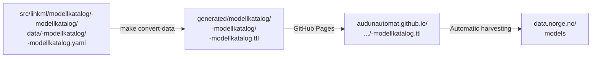

---
i18n:
  source: publisering-modell.md
  source_hash: sha256:6eea860c322162ab669fc1e59c9790a5fab2a5bf04954c64092f2e1d7c64a21b
---
# Publish to Felles Datakatalog {#publiser-til-felles-datakatalog}

!!! note "Description"

    This guide shows how information models from this repository are described in ModelDCAT-AP-NO format and **prepared for automatic harvesting** by [Felles Datakatalog](https://data.norge.no) (the national data catalog) via GitHub Pages.

The repository generates ModelDCAT-AP-NO metadata and publishes it to GitHub Pages as a harvesting endpoint.
Felles Datakatalog can be configured to harvest from this endpoint, but **the repository does not push**
directly to data.norge.no — it follows the "pull, not push" principle.

---

## Overview {#oversikt}



The catalog file (`src/linkml/modellkatalog/<organisasjon>-modellkatalog/data/<organisasjon>-modellkatalog/<organisasjon>-modellkatalog.yaml`) is a register
of the published information models and is converted to Turtle using
`<organisasjon>-modellkatalog-schema.yaml`, which imports ModelDCAT-AP-NO.

`<organisasjon>` is a generic placeholder throughout this guide — for a
complete, real example, see `src/linkml/modellkatalog/brreg-modellkatalog/`.

## How it works {#slik-fungerer-det}

1. **Modeling:** You create or update LinkML schemas in `src/linkml/<domain>/<modell>/`
2. **Generation:** `make <domain>` generates ModelDCAT-AP-NO metadata from schema annotations
3. **Publishing to GitHub Pages:** CI publishes metadata to `https://audunautomat.github.io/linkml-datamodellering-no/...`
4. **Harvesting (external process):** Felles Datakatalog can be configured to harvest from the GitHub Pages address

**Status in the PoC phase:** Steps 1-3 are implemented. Step 4 (actual harvesting to Felles Datakatalog)
must be coordinated with the Norwegian Digitalisation Agency for each organization that is to publish its
information models.

---

## Prerequisites {#fresetnader}

```bash
make check-prereqs
make mcp-val-build   # builds mcp-linkml-validator (needed for validation)
```

---

## Daily workflow — updating the catalog {#dagleg-arbeidsflyt-oppdatere-katalogen}

When you edit existing entries in
`src/linkml/modellkatalog/<organisasjon>-modellkatalog/data/<organisasjon>-modellkatalog/<organisasjon>-modellkatalog.yaml`:

**1. Create a new git branch for the change**

**2. Make the change in the catalog file:**

```yaml
informasjonsmodellar:
  - id: https://<organisasjon>.no/modellkatalogar/<organisasjon>-modellkatalog/<slug>
    tittel:
      - "@value": "<norsk tittel>"
        "@language": "nb"
    ...
```

**3. Validate schema and catalog file:**

```bash
make mcp-linkml-valider-modell \
  SCHEMA=src/linkml/modellkatalog/<organisasjon>-modellkatalog/<organisasjon>-modellkatalog-schema.yaml \
  POLICY=felles-datakatalog \
  INSTANCE=src/linkml/modellkatalog/<organisasjon>-modellkatalog/data/<organisasjon>-modellkatalog/<organisasjon>-modellkatalog.yaml
```

**4. Create a pull request to `main`:**

The CI pipeline runs the same validation automatically and publishes a new `.ttl` file
to GitHub Pages. Felles Datakatalog harvests the update in the next cycle.

!!! note "What the policy checks"
    The `felles-datakatalog` policy validates that:

    - The schema imports ModelDCAT-AP-NO
    - `Modellkatalog` has all mandatory fields (`dct:title`, `dct:description`,
      `dct:identifier`, `dct:publisher`, `dcat:contactPoint`, `dct:hasPart`)
    - `Informasjonsmodell` has all mandatory fields
    - The `dct:publisher` value is a valid `data.norge.no/organizations/<orgnr>` URI

---

## Add a new information model {#legg-til-ein-ny-informasjonsmodell}

**1. Create a new git branch for the change**

**2. Choose a stable URI slug** — the slug becomes part of a permanent URI.
The choice of slug cannot be changed after the first publication.

**3. Add to `src/linkml/modellkatalog/<organisasjon>-modellkatalog/data/<organisasjon>-modellkatalog/<organisasjon>-modellkatalog.yaml`:**

```yaml
informasjonsmodellar:
  - id: https://<organisasjon>.no/modellkatalogar/<organisasjon>-modellkatalog/<slug>
    tittel:
      - "@value": "<norsk tittel>"
        "@language": "nb"
    beskrivelse:
      - "@value": "<beskriving>"
        "@language": "nb"
    utgiver: https://data.norge.no/organizations/<orgnr>
    identifikator_literal: "https://<organisasjon>.no/modellkatalogar/<organisasjon>-modellkatalog/<slug>"
    informasjonsmodellidentifikator: "https://audunautomat.github.io/linkml-datamodellering-no/<domain>/<skjema>/"
    kontaktpunkt:
      - https://<organisasjon>.no/kontakt/modellforvaltning
    tema:
      - https://psi.norge.no/los/tema/<los-tema>
    lisens: http://publications.europa.eu/resource/authority/licence/CC_BY_4_0
```

**4.** Add the URI to the `har_del:` and `modell:` lists on the `Modellkatalog` entry.

**5. Validate and create a pull request to `main`.**

**6. After confirmed publication** — add the URI to the lock file:

```bash
echo "https://<organisasjon>.no/modellkatalogar/<organisasjon>-modellkatalog/<slug>" >> \
  src/linkml/modellkatalog/<organisasjon>-modellkatalog/published-uris.lock
```

---

## URI stability {#uri-stabilitet}

Each `Informasjonsmodell` and `Modellkatalog` has a permanent URI (the `id:` field).

!!! warning "URIs are permanent after the first publication"
    If a URI is changed after publication, Felles Datakatalog will create a
    new entry and keep the old one as a separate record — the result is
    duplicates and broken links.

### The URI register (`published-uris.lock`) {#uri-registeret-published-urislock}

`src/linkml/modellkatalog/<organisasjon>-modellkatalog/published-uris.lock` tracks all published
URIs. The CI pipeline fails a PR if a URI in the lock file is missing from the catalog file.

---

## Registering the harvesting endpoint (once) {#registrering-av-hstingsendepunkt-ein-gong}

Registration requires an **ID-porten login** and an **Altinn role** for the organization.

**Step 1** — Log in to [data.norge.no/publishing](https://data.norge.no/publishing)
with ID-porten and verify that your organization is visible.

**Step 2** — Add a new data source:

| Field | Value |
|---|---|
| **Utgjevar** (publisher) | Your organization (<orgnr>) |
| **Katalogtype** (catalog type) | Informasjonsmodellar |
| **Datakildentype** (data source type) | ModelDCAT-AP-NO |
| **Format** | Turtle |
| **Datakjelde-URL** (data source URL) | `https://audunautomat.github.io/linkml-datamodellering-no/modell/<organisasjon>-modellkatalog/<organisasjon>-modellkatalog-eksempel.ttl` |
| **Autentisering** (authentication) | (empty — the endpoint is public) |

**Step 3** — Click **«Høst»** ("Harvest") for immediate harvesting. Verify on
[data.norge.no/models](https://data.norge.no/models) that the models appear
with the correct publisher, title and LOS theme.

---

## CI pipeline {#ci-pipeline}

The following runs automatically on push to `main` when `src/linkml/modellkatalog/**` has changed:

| Job | Step | Result on failure |
|---|---|---|
| `validate` | «Valider skjema mot validation_policy» | Fails if the schema violates its configured policy (bronze for model catalog schemas) |
| `validate` | `domain-validate-data` | Fails if the catalog file violates the `felles-datakatalog` policy |
| `validate` | `check-published-uris` | Fails if a URI in the lock file is missing from the catalog file |
| `generate` | `domain-gen-data` | Publishes a new `.ttl` to GitHub Pages |

Locally:

```bash
# Validation:
make domain-validate-data DOMAIN=modellkatalog
make check-published-uris

# Conversion and preview:
make modell && make docs-publish && make docs-serve
```

---

## Document the publication in the portal {#dokumenter-publiseringa-i-portalen}

When a new information model is published and the URI has been added to
`published-uris.lock`, run:

```bash
make docs-publish
```

`publish.sh` reads the lock file and automatically adds an information box and a
«Publisert til» ("Published to") column to the generated schema page in the portal.

---

## Related documentation {#relatert-dokumentasjon}

- [New domain model](../kom-i-gang/ny-domenemodell.md) — create a new schema
- [`felles-datakatalog.yaml`](https://github.com/AudunAutomat/linkml-datamodellering-no/blob/main/src/mcp-linkml-validator/policies/felles-datakatalog.yaml) — full policy definition
- [`specs/done/publisering-felles-datakatalog.md`](https://github.com/AudunAutomat/linkml-datamodellering-no/blob/main/specs/done/publisering-felles-datakatalog.md) — technical specification
- [The ModelDCAT-AP-NO specification](https://data.norge.no/specification/modelldcat-ap-no)
- [Felles Datakatalog — models](https://data.norge.no/models)
