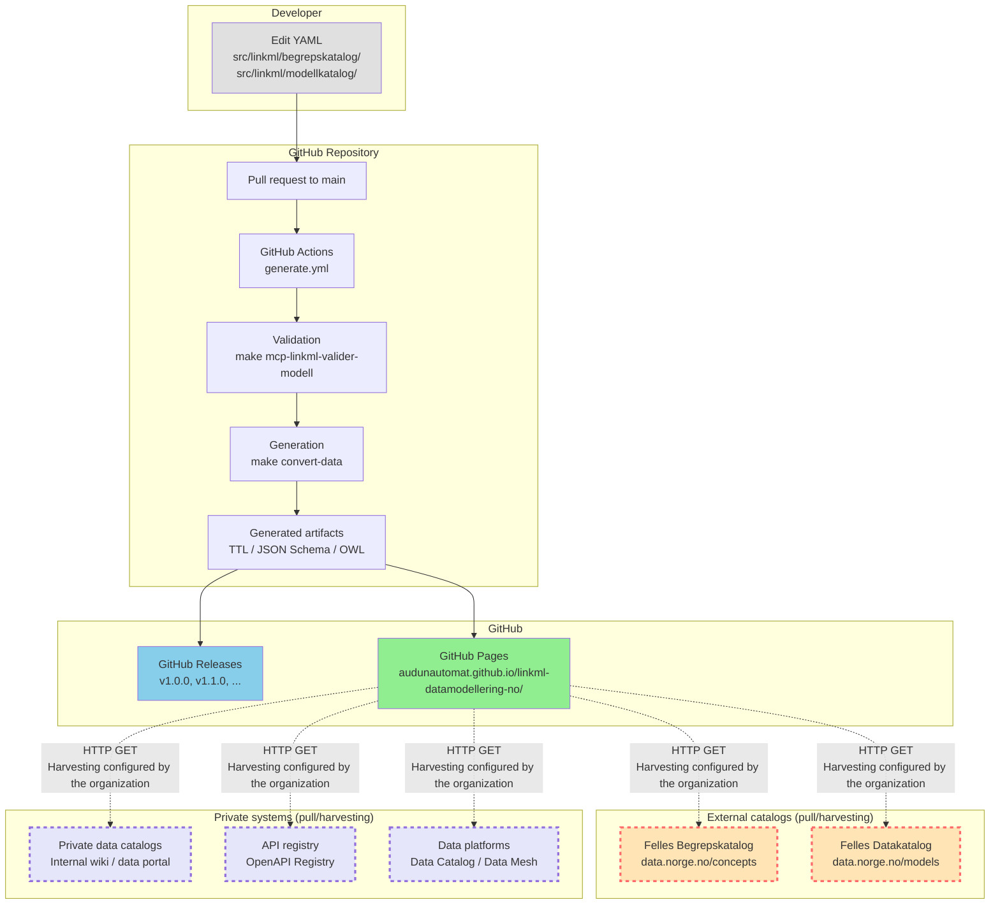
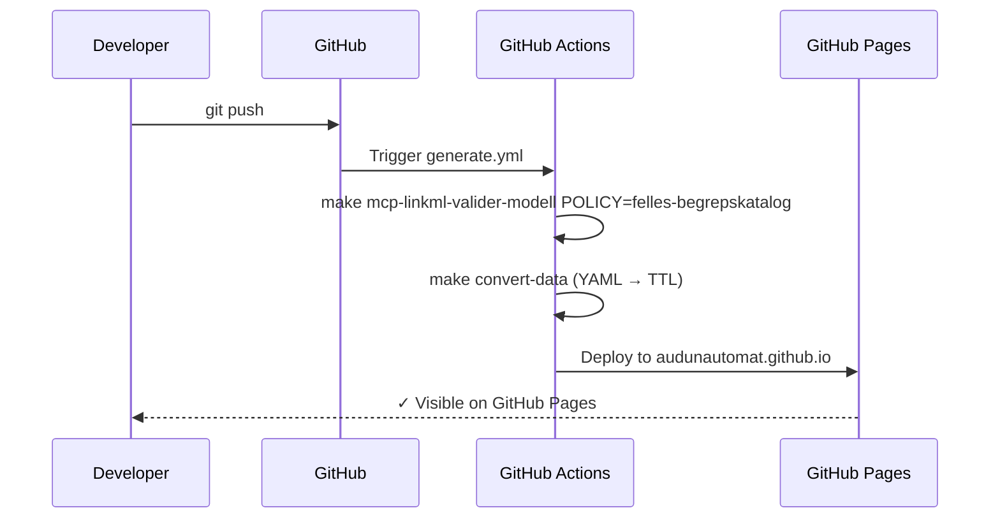
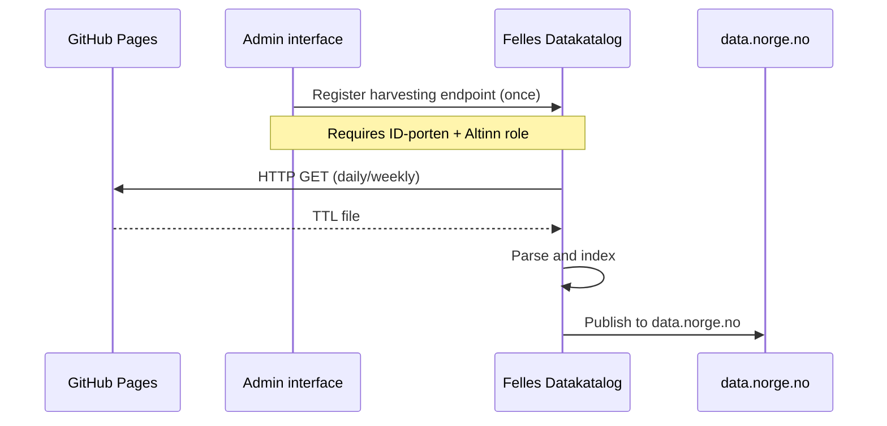

---
i18n:
  source: publisering-oversikt.md
  source_hash: sha256:fbaef251ed3a7b53ede36649ad4ef2a592f9bb0f6f157ceddccf8f055af6402c
---
# Publishing flow {#publiseringsflyt}

!!! note "Description"

    This document shows the architecture of the publishing flow from the repository to external catalogs.

!!! tip "Where does this fit into «Slik blir du en god datatilbyder»?"

    If your organization follows Digdir's guideline
    [«Slik blir du en god datatilbyder»](https://www.digdir.no/datadeling/slik-blir-du-en-god-datatilbyder/2248) ("How to become a good data provider")
    and the associated [checklist for data providers](https://www.digdir.no/datadeling/sjekkliste-datatilbyder/2273),
    this page and the rest of the repository largely cover **Step 2** of the checklist
    (making data available and preparing it for sharing):

    - **"Established standardized interfaces that enable machine transfer of data"**
      — covered by the repository's artifact library (JSON Schema, SHACL, OpenAPI,
      AsyncAPI, Protobuf, GraphQL — see
      [Generated artifacts](https://github.com/AudunAutomat/linkml-datamodellering-no/blob/main/README.en.md#generated-artifacts)
      in the README)
    - **"Published datasets and APIs on data.norge.no"** — covered by
      the pull architecture described on this page (Felles Datakatalog/
      Felles Begrepskatalog harvest from GitHub Pages)
    - **"Stated whether the data is an authoritative source"** — covered by
      the description of the `eierskapshistorikk` slot (`dct:provenance`) in
      `dcat-ap-no-schema.yaml`, which distinguishes between authoritative/self-collected and
      derived/compiled source types

    **Step 1** of the checklist (keeping data and responsibilities in order) overlaps with
    Digdir's sister guideline «Orden i eget hus» — see the cross-reference in
    [new domain model](../kom-i-gang/ny-domenemodell.md). **Steps 3-5**
    (legal basis/basis for processing, agreements, roles, access control,
    risk assessment, operating procedures) are organizational and legal
    clarifications in the individual organization, outside the scope of
    this repository.

---

## Publishing flow to external systems {#publiseringsflyt-til-eksterne-system}



**Key:**

- **Solid arrow (→):** Automatic process, controlled by the repository
- **Dashed arrow (-.->):** External process, **not** controlled by the repository
- **Red dashed border:** External public catalogs (Digdir)
- **Purple dashed border:** Private organization-internal systems

---

## Principle: Pull, not push {#prinsipp-pull-ikkje-push}

The repository follows the "pull, not push" principle:

| What the repository DOES | What the repository does NOT do |
|---|---|
| ✅ Publishes artifacts to GitHub Pages | ❌ Does not push to data.norge.no |
| ✅ Publishes releases to GitHub | ❌ Has no API credentials for Felles Begrepskatalog |
| ✅ Validates data against policies | ❌ Has no API credentials for Felles Datakatalog |
| ✅ Generates harvest-ready TTL files | ❌ Does not control when harvesting happens |
| ✅ Generates JSON Schema / OWL / Python | ❌ Has no API credentials for private data catalogs |
| ✅ The artifacts can be harvested by anyone | ❌ Does not require authentication for GitHub Pages (public) |

**Why?**

- **Simpler architecture:** The repository needs no credentials or integration with external APIs
- **Fewer dependencies:** The repository works even if Felles Begrepskatalog/Datakatalog is down
- **Flexibility:** Each organization can choose when/whether to harvest data

---

## What is published to external systems {#kva-publiserast-til-eksterne-system}

### GitHub Pages (automatic) {#github-pages-automatisk}

All generated artifacts are published automatically to GitHub Pages on push to `main`:

- **Generated schema artifacts:** SHACL, JSON Schema, OWL, Turtle, Python, Protobuf, OpenAPI, AsyncAPI, PlantUML diagrams, HTML documentation
- **Concept catalogs:** `.ttl` files from `src/linkml/begrepskatalog/*/data/` (converted from YAML)
- **Model catalogs:** `.ttl` files from `src/linkml/modellkatalog/*/data/` (converted from YAML)
- **MkDocs documentation portal:** Human-readable documentation with ER diagrams and artifact downloads

**URL:** `https://audunautomat.github.io/linkml-datamodellering-no/`

**Versioning:** Always points to the latest version on `main`. For version-stable addresses, see [Use from an external repository](../arkitektur/ekstern-bruk.md#versjonerte-artefakter).

### Felles Begrepskatalog / Felles Datakatalog (manual coordination) {#felles-begrepskatalog-felles-datakatalog-manuell-koordinering}

Data files and models marked with `publish_external: true` in `build.yaml` are made available for harvesting by [Felles Begrepskatalog](https://data.norge.no/concepts) (the national concept catalog) or [Felles Datakatalog](https://data.norge.no/models) (the national data catalog).

The repository **does not push** directly to data.norge.no — it publishes SKOS/Turtle files to GitHub Pages as a harvesting endpoint.

**What must happen for harvesting to work:**

1. **The data file must validate:** `make mcp-linkml-valider-modell SCHEMA=<skjema> POLICY=felles-begrepskatalog` (or `felles-datakatalog`) gives zero errors. This validator checks schema quality — the SHACL shapes are derived automatically from the LinkML schema and are not identical to data.norge.no's canonical shapes. Therefore also run the generated `.ttl` file through [data.norge.no/validator](https://data.norge.no/validator) (covers DCAT-AP-NO and SKOS-AP-NO — **not** ModellDCAT-AP-NO) before the harvesting endpoint is registered
2. **The organization administrator accepts the terms of use on data.norge.no:** a one-time step per organization, independent of the registration in item 3 — see [Onboarding of a new organization](https://github.com/AudunAutomat/linkml-datamodellering-no/blob/main/GOVERNANCE.md#onboarding-av-ny-organisasjon)
3. **Coordination with the Norwegian Digitalisation Agency (Digdir):** The organization registers the harvesting endpoint (requires ID-porten login and an Altinn role) — see §Registering the harvesting endpoint in [publisering-begrep.md](publisering-begrep.md#registrering-av-hstingsendepunkt-ein-gong) or [publisering-modell.md](publisering-modell.md#registrering-av-hstingsendepunkt-ein-gong)
4. **Harvesting happens externally:** Felles Begrepskatalog/Datakatalog harvest data from GitHub Pages — the repository has no control over when/whether this happens. The endpoint can be verified in advance, see [Verifying that harvesting endpoints are available externally](../automasjon/monitorering.md#verifisere-at-hstingsendepunkt-er-tilgjengelege-eksternt)

**PoC status:** Harvesting to Felles Begrepskatalog/Datakatalog is not active in the PoC phase. Data published with `publish_external: true` is test data with a limited quality guarantee. See [GOVERNANCE.md](https://github.com/AudunAutomat/linkml-datamodellering-no/blob/main/GOVERNANCE.md) for the publishing policy.

**Detailed guides:**

- [Publish concepts to Felles Begrepskatalog](publisering-begrep.md) — step by step for concept catalogs
- [Publish models to Felles Datakatalog](publisering-modell.md) — step by step for information models

---

## Private systems that can harvest {#private-system-som-kan-hste}

The artifacts published on GitHub Pages can be harvested by all kinds of systems,
not only Felles Begrepskatalog and Felles Datakatalog.

### Private data catalogs {#private-datakatalogar}

Organization-internal data catalogs can harvest LinkML schemas and data files for:
- An internal concept catalog (SKOS/Turtle)
- An internal data model registry (JSON Schema / OWL)
- Internal documentation (Markdown / HTML)

**Examples:**
- Dataporten (internal data catalog)
- Confluence (internal wiki with a data catalog plugin)
- Alation / Collibra (commercial data catalog solutions)

**Harvesting formats:**
- `.ttl` (Turtle/RDF) for semantic data catalogs
- `.json` (JSON Schema) for API-driven data catalogs
- `.md` (Markdown) for documentation portals

### API registries {#api-register}

API registries can harvest OpenAPI/AsyncAPI specifications generated from LinkML schemas:
- OpenAPI 3.1 (REST API)
- AsyncAPI 3.0 (event-driven API)
- JSON Schema (data validation)

**Examples:**
- OpenAPI Registry (internal API portal)
- SwaggerHub (commercial API registry)
- API catalog in a data platform (e.g. Apigee, Kong)

**Harvesting formats:**
- `openapi.yaml` (OpenAPI 3.1)
- `asyncapi.yaml` (AsyncAPI 3.0)
- `.json` (JSON Schema for request/response validation)

### Data platforms {#dataplattformer}

Data mesh / data lakehouse platforms can harvest metadata for:
- Data lineage (where the data came from, where it went)
- Data schema (what structure the data has)
- Data quality (which quality requirements apply)

**Examples:**
- Google Cloud Data Catalog
- AWS Glue Data Catalog
- Databricks Unity Catalog
- Snowflake Data Sharing

**Harvesting formats:**
- `.ttl` (RDF/OWL for semantic metadata)
- `.json` (JSON Schema for structural metadata)
- `.proto` (Protobuf for schema evolution)

---

## Where generated files end up {#kvar-genererte-filer-endar}

### 1. `generated/` (local build) {#1-generated-lokal-build}

**Where:** `/generated/<domain>/<modell>/`

**Contents:**
- SHACL shapes (`.ttl`)
- JSON Schema (`.json`)
- OWL ontology (`.ttl`)
- Python classes (`.py`)
- Protobuf (`.proto`)
- Documentation (`docs/`)
- PlantUML diagrams (`.puml`, `.svg`)
- ER diagrams (`.md`)

**Git status:** Ignored (in `.gitignore`) — not checked in

**Purpose:** Local testing and verification before pushing

---

### 2. GitHub Pages (automatic publishing) {#2-github-pages-automatisk-publisering}

**URL:** `https://audunautomat.github.io/linkml-datamodellering-no/`

**Where it came from:** The CI job `generate.yml` (runs on push to `main`)

**Contents:**
- All generated artifacts (the same as `generated/`)
- Concept catalogs: `.ttl` files from `src/linkml/begrepskatalog/*/data/`
- Model catalogs: `.ttl` files from `src/linkml/modellkatalog/*/data/`
- MkDocs documentation portal

**Versioning:** Always points to the latest version on `main` — **not version-stable**

**Purpose:**
- Documentation portal for human users
- Harvesting endpoint for Felles Begrepskatalog / Felles Datakatalog

---

### 3. GitHub Releases (versioned artifacts) {#3-github-releases-versjonerte-artefakter}

**URL:** `https://github.com/AudunAutomat/linkml-datamodellering-no/releases`

**Where it came from:** `release-please` creates a release when a release PR is merged

**Contents:**
- Source code (`.zip`, `.tar.gz`)
- (Potentially) bundled artifacts as release assets

**Versioning:** Semantic versioning (`v1.0.0`, `v1.1.0`, etc.) — **version-stable**

**Purpose:**
- Stable URIs for imports from external repositories
- Historical archive of earlier versions

---

## From commit to visible on data.norge.no {#fra-commit-til-synleg-pa-datanorgeno}

The whole flow from a code change until the concept/model is searchable on
data.norge.no — shown first as diagrams (architecture overview), then as a
concrete command-line walkthrough of the same steps (operational detail).

### Diagram: steps 1-4 (the repository's responsibility, automatic) {#diagram-steg-1-4-repoet-sitt-ansvar-automatisk}



### Diagram: steps 5-6 (external process, manual coordination) {#diagram-steg-5-6-ekstern-prosess-manuell-koordinering}



### Step by step with commands {#steg-for-steg-med-kommandoar}

**1. The developer creates a pull request to `main`:**

```bash
# Update main
git switch main
git pull origin main

# Create a new working branch
git switch -c feature/mi-endring

# Make changes
git add src/linkml/begrepskatalog/brreg-begrepskatalog/data/brreg-begrepskatalog/brreg-begrepskatalog.yaml
git commit -m "feat(brreg-begrepskatalog): legg til nytt begrep 'aksjonær'"

# Push the branch
git push -u origin feature/mi-endring

# Create a pull request to main in the GitHub interface
```

**2. CI validates and generates** (`generate.yml`, ~3-5 minutes, depending on the size of the changes):

1. Validates the data file: `make mcp-linkml-valider-modell POLICY=felles-begrepskatalog`
2. Generates the `.ttl` file: `make convert-data`
3. Publishes to GitHub Pages: `actions/deploy-pages@v1`

**3. GitHub Pages is updated:**

`https://audunautomat.github.io/linkml-datamodellering-no/begrepskatalog/brreg-begrepskatalog/brreg-begrepskatalog.ttl` now contains the updated data file in SKOS/Turtle format.

**4. Felles Begrepskatalog harvests** (external process, varies — minutes to days):

**Who:** The Norwegian Digitalisation Agency / the Felles Begrepskatalog system  
**When:** Depending on the harvesting interval (e.g. daily, weekly)  
**How:** HTTP GET from the GitHub Pages URL  
**Control:** The repository has no control over when/whether harvesting happens

**5. Visible on data.norge.no:**

The concept is shown on [data.norge.no/concepts](https://data.norge.no/concepts) after harvesting and indexing are complete.

---

## Manifest configuration {#manifest-konfigurasjon}

Each data file under `src/linkml/*/data/<katalog>/` has a `build.yaml`:

```yaml
publish_external: true  # Publish to GitHub Pages?
validation_policy: felles-begrepskatalog  # Validation policy
```

**Effect of `publish_external`:**

| Value | GitHub Pages | Harvesting endpoint | Felles Begrepskatalog/Datakatalog |
|---|---|---|---|
| `true` | ✅ Published | ✅ Available | ⚠️ Can be harvested (if configured) |
| `false` | ❌ Not published | ❌ Not available | ❌ Cannot be harvested |

---

## Troubleshooting {#feilsking}

### Problem: "I have pushed to main, but I do not see the changes on GitHub Pages" {#problem-eg-har-pusha-til-main-men-ser-ikkje-endringane-pa-github-pages}

**Solution:**
1. Check that the CI job `generate` is green: https://github.com/AudunAutomat/linkml-datamodellering-no/actions
2. Check that `publish_external: true` in `build.yaml`
3. Wait 3-5 minutes for GitHub Pages to be updated
4. Hard-refresh in the browser (Ctrl+Shift+R)

### Problem: "GitHub Pages is updated, but I do not see the changes on data.norge.no" {#problem-github-pages-er-oppdatert-men-eg-ser-ikkje-endringane-pa-datanorgeno}

**Solution:**
1. Verify that the harvesting endpoint is registered at [admin.fellesdatakatalog.digdir.no](https://admin.fellesdatakatalog.digdir.no)
2. Contact the Norwegian Digitalisation Agency (dataopen@digdir.no) to verify the harvesting status
3. Consider manual harvesting via the admin interface (the "Høst no" / "Harvest now" button)

**NB:** The repository has no way of verifying whether harvesting actually happens — it is outside the repository's control.

---

## Summary {#oppsummering}

| Step | Responsible | Automatic? | Verifiable? |
|---|---|---|---|
| 1. Edit YAML | Developer | No | Yes (local validation) |
| 2. Pull request to `main` | Developer | No | Yes (GitHub) |
| 3. CI generates artifacts | GitHub Actions | Yes | Yes (Actions log) |
| 4. Publish to GitHub Pages | GitHub Actions | Yes | Yes (check the URL) |
| 5a. Harvesting by Felles Begrepskatalog/Datakatalog | The individual organization | No (manual setup) | No (not available to the repository) |
| 5b. Harvesting by private systems | Organization | No (manual setup) | No (not available to the repository) |
| 6. Visible on data.norge.no / internal system | Norwegian Digitalisation Agency / organization | Yes (after harvesting) | Yes (manual check) |

**Conclusion:** The repository controls steps 1-4. Steps 5a/5b and 6 are external processes that must be coordinated with the Norwegian Digitalisation Agency or your own organization.

---

## Related documentation {#relatert-dokumentasjon}

- [publisering-begrep.md](publisering-begrep.md) — guide for concept catalogs
- [publisering-modell.md](publisering-modell.md) — guide for model catalogs
- [monitorering.md](../automasjon/monitorering.md) — how to monitor publishing
- [GOVERNANCE.md](https://github.com/AudunAutomat/linkml-datamodellering-no/blob/main/GOVERNANCE.md) — publishing policy
